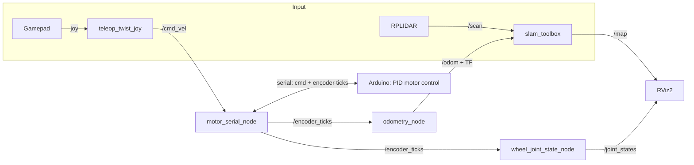

# Autonomous Mars Rover — ROS 2 SLAM Navigation Stack
 
A four-wheeled, differential-drive rover built to autonomously map and navigate unknown terrain — developed as part of Queen's University's MREN 203 (Mechatronics System Design) course.
 
The rover runs a full ROS 2 stack split across a Raspberry Pi (high-level autonomy) and an Arduino (low-level motor control), performing real-time SLAM-based mapping and localization in both a custom Gazebo simulation and on physical hardware.
 
## What it does
 
- **Drives itself, or hands off to a human.** The rover can be teleoperated with a gamepad while simultaneously building a map of its surroundings, or run autonomously off the same sensor pipeline.
- **Builds a map as it moves.** Wheel encoder data and 2D LIDAR scans feed into [slam_toolbox](https://github.com/SteveMacenski/slam_toolbox) to generate occupancy-grid maps and localize the rover in real time, on both the simulated and real robot.
- **Bridges ROS 2 and embedded hardware.** A custom serial protocol streams velocity commands down to an Arduino-based motor driver (PID-controlled) and streams encoder ticks back up, closing the control loop between high-level planning and low-level actuation.
- **Estimates its own motion.** Raw encoder ticks are converted into full odometry (position, heading, and velocity) using differential-drive kinematics, and published as both a `nav_msgs/Odometry` topic and a live TF transform.
- **Has a matching digital twin.** A custom Mars-terrain world was built in Gazebo so the full navigation stack — controls, odometry, SLAM, visualization — could be developed and validated in simulation before ever touching hardware.
## System architecture
 

 
## Package layout
 
| Package | Description |
|---|---|
| `main_pkg` | Core ROS 2 nodes, launch files, robot description (URDF/xacro), and configuration for control, odometry, SLAM, and visualization |
| `serial_motor_msgs` | Custom message definitions for encoder feedback over serial |
 
Key nodes:
- `motor_serial_node` — serial bridge between ROS 2 and the Arduino motor controller
- `odometry_node` — converts encoder deltas into odometry and broadcasts the `odom → base_link` transform
- `wheel_joint_state_node` — publishes wheel joint states for accurate RViz visualization
## Tech stack
 
`ROS 2 (Humble)` · `Python (rclpy)` · `Gazebo` · `RViz2` · `slam_toolbox` · `URDF / Xacro` · `ros2_control` · `Arduino (serial motor control)`
 
## Simulation & results
 
The stack was validated in a custom-built Mars-terrain Gazebo world as well as several indoor test environments on physical hardware, successfully generating occupancy-grid maps and closed-loop odometry in each case.
